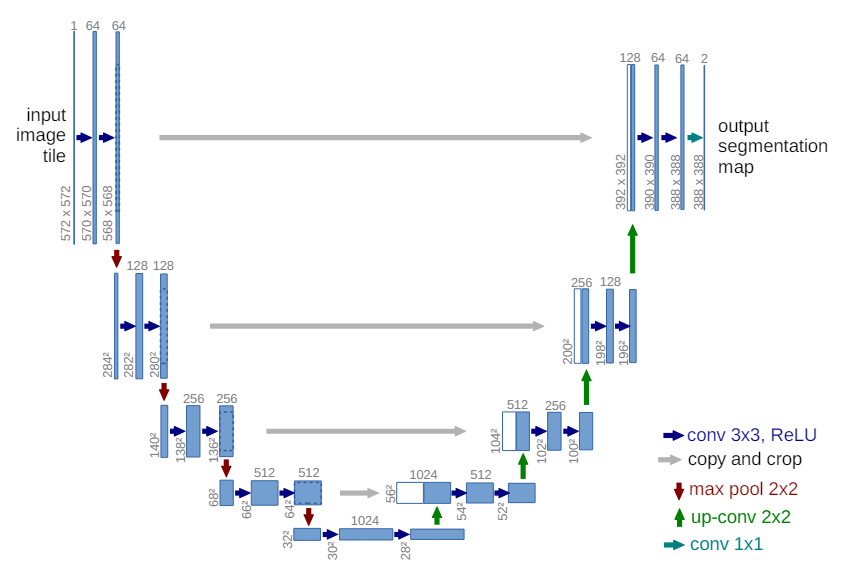

# U-NET Implementation

U-NET Implementation based on it's paper using Pytorch.

Note: the network was trained using a NVIDIA RTX 4050.

## Architecture:

UNET (name given because of the shape of the architecure) uses a Encoder-Decoder architecture. The encoder is responsible for extracting features from the image by downsizing it using CNN's (followed by ReLU) and max pooling (while the net downsizes it, the channels double for each step). The decoder is responsible for upsampling the image (using Transposed Convolution). While upsampling, the Net halves the channels for each step.

Each connection (gray arrows) concatenates the equivalent images in upscaling and downscaling. This step is in important, for instance, for image segmentation, so the Net can learn how pixel-perfectly delimit objects in an image given it's mask.

## Model evaluation

Considering the following metric:

$$
\frac{\text{pixels\_predicted\_correctly}}{\text{total\_pixels}}
$$

The best accuracy that I've managed to get is **73%** after experimenting with multiple combinations of hyperparameters (located at **hp.toml**). The resulting images from this project (expected mask and predicted output) can be seen at **saved_images** folder.

## References:

Original paper at [arxiv](https://arxiv.org/abs/1505.04597).

Great [video explaining the architecture](https://www.youtube.com/watch?v=NhdzGfB1q74).

Implementation [coded along with this video](https://www.youtube.com/watch?v=IHq1t7NxS8k).

